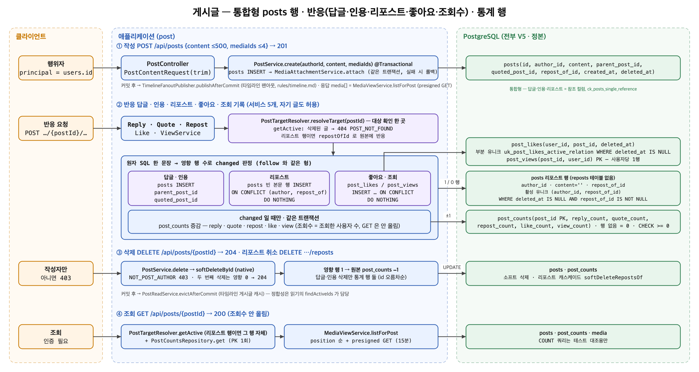

# 게시글 설계

## 문서 목적과 범위

- 이 문서는 게시글과 그 위에 얹히는 다섯 가지 상호작용 — 답글 · 인용 · 리포스트 · 좋아요 · 조회수 — 의 데이터 모델, 멱등 규칙과 통계 집계 방식을 설명한다.
- 행위자 결정 (세션 principal = `users.id`)과 인증은 `서버 세션과 Redis 중앙 저장소 설계.md`, 멱등 관계 행·통계 행의 원형은 `팔로우 시스템 설계.md`를 따른다. 이 문서는 그
  결정을 반복하지 않고 게시글에서 달라지는 점만 적는다.
- 이 문서로 GLOSSARY §0 의 경계 "게시물 없음" 을 개정한다. 목록 · 피드 · 검색 · **첨부 중 이미지 외**(이미지 첨부는 `docs/미디어 설계.md` 로 2026-09-20 개정 — 게시글 요청의 `mediaIds`)는 여전히 범위 밖이다. **타임라인은 예정된 기능**이며, 이 문서의 데이터 모델은 그것을 전제로
  잡았다 (리포스트를 게시글 행으로 두는 이유).

## 아키텍처 흐름



## 1. 게시글 도메인

### 문제

- 사용자가 500자 이하의 글을 올리고, 남의 글에 답글을 달거나 자기 말을 붙여 인용하거나 본문 없이 리포스트할 수 있어야 한다.
- 답글 · 인용 · 리포스트는 "원본을 가리키는 게시글" 이라는 점에서 같은 성질이지만, 어떤 게시글이 둘 이상의 종류일 수는 없어야 한다. 원본이 사라져도 답글·인용은 남아야 하고, 본문 없는 리포스트는 원본과
  함께 사라져야 한다.
- 예정된 타임라인이 게시글 · 답글 · 인용 · 리포스트를 시간순 한 줄기로 보여 주려면 한 테이블을 한 번 훑어야 한다.
- 삭제는 작성자만 할 수 있어야 하고, 삭제된 글은 어느 경로로도 다시 보이거나 반응의 대상이 되어서는 안 된다.

### 근거와 도입 방법

**한 테이블, 세 참조 컬럼 (통합형)**

- `posts(id, author_id → users, content VARCHAR(500), parent_post_id → posts, quoted_post_id → posts, repost_of_id → posts, created_at, deleted_at)`
한 테이블 (`postgresql/V5`)에 일반 게시글 · 답글 · 인용 · 리포스트를 모두 둔다. 답글은 `parent_post_id`, 인용은 `quoted_post_id`, 리포스트는
`repost_of_id` 가 있는 행이다.
- `ck_posts_single_reference` 가 세 참조 중 최대 하나만 허용하고, `ck_posts_repost_has_no_content` 가 "리포스트 행만 본문이 비어 있다" 를 강제한다 (`(repost_of_id IS NULL) =
  (content <> '')`).
- 종류별 테이블 (`replies`, `quotes`, `reposts`)로 나누면 타임라인이 다중 테이블 조인·UNION 이 되고 커서 페이지네이션이 테이블마다 갈라진다. 한 테이블이면 타임라인이 단일 스캔이고
  답글의 답글도 같은 규칙으로 자연히 된다. 처음엔 리포스트를 `reposts` 관계 행으로 두었으나 타임라인이 예정된 것이 확정되어 통합형으로 바꿨다.
- 원본 참조 FK 는 답글·인용이 `ON DELETE SET NULL`(원본이 물리 삭제되어도 본문이 있는 답글·인용은 남고 참조만 끊김), 리포스트가 `ON DELETE CASCADE`(본문이 없어 원본 없이는
  의미가 없음)다. 답글·인용까지 `CASCADE` 면 탈퇴한 사용자의 글에 달린 남들의 답글이 지워지고, `RESTRICT` 면 탈퇴가 막힌다.
- 조회 인덱스는 `author_id`, 그리고 활성 행만 담는 부분 인덱스 `(parent_post_id) WHERE deleted_at IS NULL AND parent_post_id IS NOT NULL` 과
  `quoted_post_id`·`repost_of_id`
  의 같은 꼴이다. 목록 API 는 아직 없지만 통계 대조 (`COUNT`)와 후속 목록 기능이 이 인덱스를 쓴다. 리포스트의 멱등성은 `uk_posts_active_repost` = `(author_id, repost_of_id) WHERE
  deleted_at IS NULL AND repost_of_id IS NOT NULL` 부분 유니크가 보장한다.

**삭제**

- 삭제는 `deleted_at` 소프트 삭제뿐이다 (`softDeleteById`, 영향 행 1 → `changed`). 물리 삭제는 작성자 탈퇴 CASCADE 로만 일어난다.
- 작성자만 지울 수 있다 (`403 NOT_POST_AUTHOR`). 이미 지운 글을 작성자가 다시 지우면 `204` 로 멱등하다 — 삭제 판정은 삭제 여부와 무관한 `findById` 로 작성자를 먼저 확인하기
  때문에 가능하다.
- 삭제된 게시글은 **조회 · 반응 경로에서 없는 것**이다 (삭제 API 만 위 항목의 예외). 조회 · 답글 · 인용 · 리포스트 · 좋아요 · 조회 기록의 대상 확인이
  `PostTargetResolver.getActive`(`deleted_at IS NULL`, `PostService` 와 분리된 대상 해석 컴포넌트 — 2026-09-20 SRP 리팩토링으로 옮김)
  한 곳으로 모이며, 실패는 `404 POST_NOT_FOUND` 다.
- **리포스트 행에 대한 반응은 원본에 귀속된다.** 반응 경로의 대상 해석은 `PostTargetResolver.resolveTarget` — 활성 게시글을 찾고, 그것이 리포스트 행이면
  `repost_of_id` 의 활성 원본으로 바꾼다. 리포스트 행에 답글·인용·리포스트·좋아요·조회 기록을 보내면 원본의 관계·통계가 움직이고, 리포스트 행 자신의 통계는 항상 0 이다. 원본이 삭제된 리포스트
  행은 대상이 될 수 없다 (404). 리포스트 행의 `DELETE /api/posts/{id}`(작성자 = 리포스트한 사용자)는 `DELETE …/repost` 와 같은 결과다.
- **쓰기 경로의 대상 확인은 최종 대상을 `FOR SHARE` 로 읽는다.** `resolveTarget` 은 무잠금 조회로 대상 (리포스트 행이면 원본)을 정한 뒤 그 한 행만
  `SELECT … FOR SHARE`
  (`findActiveByIdForShare`, `@Lock(PESSIMISTIC_READ)`)로 다시 읽는다. 원본 삭제 트랜잭션 (`softDeleteById` 의
  `UPDATE posts … WHERE id = ?` 행 잠금)과 직렬화되어, 늦게 온 쪽은 PostgreSQL 의 재평가에서 `deleted_at IS NULL` 이 거짓이 되어 404 를 받는다. 잠금 없이
  읽으면 READ COMMITTED 에서 삭제 트랜잭션이 `softDeleteRepostsOf` 를 지나간 뒤 커밋되는 리포스트 행이 캐스케이드를 비껴가 — 삭제된 원본을 가리킨 채 활성으로 남고 (`GET`
  200, 원본은 404), 리포스트한 사용자는 `DELETE …/repost` 가 404 라 되돌릴 수 없으며, 삭제된 원본의 `repost_count` 가 잔류한다. 답글·인용도 같은 창에서 삭제된 원본을
  가리킬 수 있지만 그쪽은 물리 삭제 `SET NULL` 과 같은 "남긴다" 의미라 계약과 어긋나지 않는다 — 잠금은 리포스트 캐스케이드 약속을 지키기 위한 것이고 다른 반응 경로는 같은 코드를 지나므로 함께
  얻는다. `GET` 은 잠그지 않는다. 리포스트 행 자체는 잠그지 않는다 — 삭제가
  `posts(원본) → posts(리포스트 행들)` 순으로 잠그므로 반응이 `posts(리포스트 행) → posts(원본)` 순으로 잡으면 교착한다. 공유 잠금이라 반응끼리는 경합하지 않고 삭제와만 직렬화되므로
  인기 글의 핫 로우 비용은 통계 행 갱신과 같은 수준이다. 경합 창 자체는 자동 테스트로 재현하지 않는다 (`PostServiceTests` 는 잠금 조회 호출 여부만 확인).
- **원본을 소프트 삭제하면 활성 리포스트 행도 같은 트랜잭션에서 소프트 삭제된다**(`softDeleteRepostsOf`, `idx_posts_active_repost_of` 사용)— "본문 없는 리포스트는
  원본과 함께 사라진다" 를 물리 삭제 (FK CASCADE)뿐 아니라 운영에서 실제로 쓰는 소프트 삭제에도 적용한다. 영향 행 수만큼 원본의 `repost_count` 를 내려 통계 대조 불변식을 유지한다.
  이렇게 하지 않으면 원본이 사라진 뒤 리포스트한 사용자가 자기 리포스트를 취소할 길이 없고 (`DELETE …/repost` 는 원본 404, 리포스트 행 id 는 응답에 없음) 타임라인에 원본 없는 카드가
  남는다. 잠금 순서는 `posts(원본) → [post_counts(parent/quoted), 원본이 답글·인용일 때] → posts(리포스트 행들) → post_counts(원본)` 로 반응 경로
  (`posts(원본) FOR SHARE → 관계 행 → post_counts(원본)`)와 교착하지 않는다 — 통계 행은 언제나 마지막에 잡고, 두 통계 행을 잡는 유일한 경로 (답글·인용 삭제)는 parent →
  self 즉 id 오름차순이다. 리포스트 행 자신을 지울 때는 캐스케이드하지 않는다 (체인이 없으므로 대상이 없다).

**API 와 행위자**

- `POST /api/posts`, `POST /api/posts/{postId}/replies`, `POST /api/posts/{postId}/quotes` 는 `{content}` 를 받아 `201` 로
  게시글 응답을 돌려준다. 본문은 공백 제거 후 1~500자 (`@NotBlank`, `@MaxCodePoints(500)`) — 검증 실패는 `400 INVALID_REQUEST`. 자릿수는 **코드포인트** 로
  센다:
  `@Size` 는 UTF-16 단위 (`String.length`)라 이모지 하나를 2 로 보지만 `VARCHAR(500)` 은 코드포인트 단위라, 앱이 DB 보다 엄격해져 README 의 "500자·이모지
  허용" 과 어긋났다 (2026-09-20 리뷰).
  `@Pattern` 과의 평가 순서는 정해져 있지 않지만 (Bean Validation 은 같은 필드의 제약을 순서 없이 전부 평가한다) `String.codePointCount` 는 짝 없는 서로게이트도 1 로
  세고 예외를 내지 않으므로 순서에 무관하게 안전하다.
- 앞뒤 공백 제거는 요청 DTO (`PostContentRequest`) 생성 시점 **한 곳**에서 Kotlin `trim()` 으로 하고, 검증과 저장이 같은 값을 본다. `@NotBlank` 가 쓰는 Java
  `trim` 은 U+0020 이하만 공백으로 보는 반면 Kotlin `trim()` 은 전각 공백 (U+3000)·NBSP 까지 걷어내므로, 서비스에서 따로 trim 하면 검증을 통과한 빈 본문이 저장된다
  (리뷰에서 잡힌 결함).
- NUL (U+0000) 은 어느 trim 도 걷어내지 않지만 PostgreSQL 이 문자열 타입에 허용하지 않아 INSERT 에서 500 이 나고, 짝 없는 서로게이트 (U+D800~DFFF)는 PgJDBC 가
  `?` 로 바꿔 저장하므로 둘 다
  `@Pattern` 으로 400 처리한다 (정상 이모지는 서로게이트 쌍이 한 코드포인트로 매칭돼 통과). 제로폭 공백 (U+200B) 은 공백 정의 밖이라 막지 않는다.
- `GET /api/posts/{postId}` 는 게시글과 통계 (`counts`)를 함께 돌려준다 (리포스트 행이면 `content = ""`, `repostOfId` 가 채워짐).
  `DELETE /api/posts/{postId}` 는 `204`.
- 작성자는 항상 세션 주체 (`@AuthenticatedUser AuthenticatedPrincipal.id`)다. 요청 본문에 작성자 ID 자리는 없다 (팔로우와 같은 결정).
- 자기 글에 답글 · 인용 · 리포스트 · 좋아요 하는 것을 막지 않는다. 자기 팔로우와 달리 데이터 의미가 깨지지 않기 때문이다.

**레이어별 책임**

- `post.domain`: `Post` · `PostCounts` · `PostLike` · `PostView` 엔티티, 저장소 계약 (`PostRepository` — 게시글·리포스트 행 ·
  `PostCountsRepository` — 통계 행 ·
  `PostLikeRepository` · `PostViewRepository`),
  `PostErrorCode`.
- `post.application`: 사용자가 열거한 여섯 유스케이스가 서비스 하나씩이다 — `PostService`(작성 · 조회 · 삭제) + `PostTargetResolver`(활성 확인 · 대상 해석 —
  반응 서비스 다섯이 이것만 의존) · `ReplyService` ·
  `QuoteService` · `RepostService` ·
  `LikeService` · `ViewService`. 뒤의 다섯은 `PostTargetResolver.resolveTarget` 로 대상 (리포스트 행이면 원본)을 확인하고 같은 트랜잭션에서 통계 행을
  증감한다.
- `post.infrastructure`: `SpringData*JpaRepository` 의 native SQL (`ON CONFLICT`, 소프트 삭제, 통계 upsert)과 어댑터.
- `post.presentation`: `PostController`(작성 · 조회 · 삭제 · 답글 · 인용) · `PostEngagementController`(리포스트 · 좋아요 · 조회 기록).

### 결과

- 게시글 · 답글 · 인용 · 리포스트가 한 테이블에서 같은 규칙으로 다뤄져 타임라인이 단일 테이블 스캔이 되고, 두 종류를 겸하는 행과 본문 있는 리포스트는 DB 가 막는다.
- 삭제는 작성자만 할 수 있고 멱등하며, 삭제된 글은 어떤 상호작용의 대상도 되지 않는다.

## 2. 답글과 인용

### 문제

- 답글과 인용은 원본이 활성일 때만 만들 수 있어야 하고, 원본의 "답글 몇 개 · 인용 몇 개" 가 실제 활성 답글 · 인용 수와 늘 같아야 한다.

### 근거와 도입 방법

- `ReplyService.reply` · `QuoteService.quote` 는 `resolveTarget(대상)`(리포스트 행이면 원본으로, 최종 대상 `FOR SHARE`) → `posts` INSERT →
  같은 트랜잭션에서 원본의
  `post_counts.reply_count`/`quote_count` +1 순서다. INSERT 는 항상 새 행이므로 팔로우와 달리 "이미 있음" 분기가 없다.
- 답글 · 인용을 삭제하면 (`PostService.delete`) 소프트 삭제가 실제로 일어났을 때만 (`changed`) 원본의 해당 수를 −1 한다. 두 번째 삭제는 영향 행 0 이라 내리지 않는다.
- 인용과 리포스트의 차이는 **본문 유무**다. 인용은 본문이 있는 게시글 행 (`quotedPostId`), 리포스트는 본문이 빈 게시글 행 (`repostOfId`)이다. 둘 다 `posts` 에 있어
  타임라인에 함께 실린다.

### 결과

- 원본의 답글 수 · 인용 수는 답글 · 인용 행의 생성 · 소프트 삭제와 같은 트랜잭션에서 움직여 활성 행 수와 일치한다.

## 3. 리포스트와 좋아요

### 문제

- 같은 사용자가 같은 글을 두 번 리포스트하거나 좋아요할 수 없어야 하고, 반복 · 동시 요청도 클라이언트 재시도가 안전해야 한다.
- 리포스트는 타임라인에 실리는 게시글이면서 동시에 "누가 이 글을 퍼갔다" 는 멱등 관계여야 한다.

### 근거와 도입 방법

**리포스트 = 본문 없는 게시글 행**

- 리포스트는 `posts` 에 `author_id` = 리포스트한 사용자, `repost_of_id` = 원본, `content = ''` 인 행으로 저장한다. 활성 리포스트는 사용자·원본 쌍당 1개
  (`uk_posts_active_repost` 부분 유니크), 취소는 그 행의 소프트 삭제, 다시 하면 새 행이다.
- 쓰기는 `INSERT … ON CONFLICT (author_id, repost_of_id) WHERE deleted_at IS NULL AND repost_of_id IS NOT NULL DO NOTHING`
  (`insertRepostIfAbsent`) 과 `UPDATE posts SET
  deleted_at … WHERE author_id = ? AND repost_of_id = ? AND deleted_at IS NULL`(`softDeleteRepost`) 의 영향 행 수로 `changed`
  를 만든다. `PUT`/`DELETE /api/posts/{postId}/repost`
  는 결과가 원하는 상태면 항상 `204` 다.
- `postId` 가 리포스트 행이면 `resolveTarget` 이 원본으로 바꾸므로 "리포스트의 리포스트" 는 원본의 리포스트가 된다.
- 기각한 대안: `reposts(user_id, post_id)` 관계 행 (초기 설계) — 타임라인이 `posts UNION ALL reposts JOIN posts` 가 되고 커서 페이지네이션이 두 테이블에
  걸친다. 타임라인이 범위 밖일 때는 단순해서 택했으나, 타임라인이 예정된 기능으로 확정되어 통합형으로 바꿨다 (V5 미커밋 시점이라 마이그레이션을 고쳐 썼다).

**좋아요 = 멱등 관계 이력 행**

- `post_likes(id, user_id, post_id, created_at, deleted_at)` 는 `follows` 와 같은 멱등 관계 이력 행이다. 활성 관계는
  `(user_id, post_id) WHERE deleted_at IS NULL` 부분 유니크로 쌍당 1개, 취소는 소프트 삭제, 다시 하면 새 행이다. 좋아요는 타임라인에 실리지 않으므로 게시글 행일 이유가
  없다.
- 쓰기는 `INSERT … ON CONFLICT (user_id, post_id) WHERE deleted_at IS NULL DO NOTHING` 과 소프트 삭제 UPDATE 의 영향 행 수로 `changed`
  를 만든다. `PUT`/`DELETE
  /api/posts/{postId}/like` 는 항상 `204`.

**공통**

- `changed` 일 때만 같은 트랜잭션에서 원본의 `post_counts.repost_count`/`like_count` 를 증감한다. 동시 8 좋아요 테스트 (`PostApiTests`, 같은 사용자·서로
  다른 사용자 각 1건)가 관계 1행 · 통계 +1 로 수렴함을 실 PostgreSQL 에서 검증한다. 리포스트는 SQL 형이 다르지만 중재 인덱스 추론 실패는 동시성과 무관하게 첫 호출에서 드러나고 (반복 PUT
  테스트) `ON
  CONFLICT DO NOTHING` 의 동시 의미는 테이블과 무관하므로 동시 테스트를 따로 두지 않는다.
- 팔로우와 마찬가지로 Redis 잠금 · 조회-후-삽입은 쓰지 않는다 (`팔로우 시스템 설계.md` "3. 동시성").

### 결과

- 리포스트 · 좋아요는 반복 · 동시 요청에서 활성 1개와 통계 +1 로 수렴하고, 취소 · 재실행 이력이 남는다. 리포스트는 게시글 행이라 타임라인이 원글과 같은 스캔으로 가져간다.

## 4. 조회수

### 문제

- 조회수는 가장 잦은 쓰기이면서 가장 부풀리기 쉬운 숫자다. 새로고침 · 재시도 · 스크립트가 같은 사용자의 조회를 여러 번 보내도 숫자가 늘어서는 안 된다.

### 근거와 도입 방법

- 조회수를 **"조회한 사용자 수"** 로 정의한다. `post_views(post_id, user_id, viewed_at)` 의 PK `(post_id, user_id)` 가 사용자당 1행을 강제하고, `INSERT … ON CONFLICT (post_id,
  user_id) DO NOTHING` 의 영향 행이 1일 때만 `view_count` +1 이다.
- 조회 기록은 `GET` 이 아니라 별도의 `POST /api/posts/{postId}/views`(`204`, CSRF 필요)다. 조회 API 가 상태를 바꾸면 캐시 · 프리페치 · 크롤러가 숫자를 흔들고
  `GET` 에 CSRF 를 걸 수도 없다.
- 되돌리는 동작이 없으므로 `deleted_at` 이 없다. 게시글이나 사용자가 물리 삭제되면 CASCADE 로 사라진다.
- 기각한 대안: ① 요청마다 +1 (원시 카운트) — 멱등 약속 (GLOSSARY §0 ②)에 어긋나고 부풀리기가 쉽다. 필요해지면 `post_views` 를 두고 `view_count` 증감 조건만 바꾸면 된다.
  ② Redis HyperLogLog · 카운터 — 이중 저장소 정합성 문제가 다시 생긴다 (`팔로우 시스템 설계.md` "2. 팔로워 수와 팔로잉 수 — 개정" 의 기각 사유와 같다).

### 결과

- 조회수는 사용자당 한 번만 오르고, 같은 사용자의 재조회는 `204` 로 멱등하게 끝난다.

## 5. 게시글 통계

### 문제

- 게시글 하나에 다섯 종류의 숫자 (답글 · 인용 · 리포스트 · 좋아요 · 조회수)가 붙고 조회마다 함께 나간다. 팔로워 수와 같은 이유로 매 조회마다 다섯 번 `COUNT` 하면 인기 글일수록 느려진다.

### 근거와 도입 방법

- 팔로우의 `follow_counts` 결정을 그대로 가져와
  `post_counts(post_id PK → posts, reply_count, quote_count, repost_count, like_count, view_count)` **게시글 통계 행**을 둔다.
  `CHECK (>= 0)`, 행이 없는 게시글은 0 으로 읽는다. 팔로우 쪽에서 이미 실측으로 근거를 확보했으므로 (팔로워 100만 사용자 `COUNT` 41 ms → PK 0.07 ms) 여기서 다시 재지
  않는다.
- **증감 규칙** — 관계 행의 INSERT · 소프트 삭제가 실제로 일어난 (영향 행 1) 같은 트랜잭션에서만 증감한다. 증가는 `INSERT … ON CONFLICT (post_id) DO UPDATE`(행이
  없으면 생성), 감소는
  `UPDATE … WHERE 각 컬럼 >= delta` 가드로 0 아래로 내리지 않는다. 다섯 컬럼을 한 SQL 로 다루고 `PostCountDelta` 로 어느 컬럼을 얼마나 움직일지 넘긴다.
- **잠금 순서** — 반응 경로는 대상 `posts` 행을 `FOR SHARE` 로 먼저 잡고 ("1. 게시글 도메인"), 통계 행을 하나 (원본)만 잡는다. 두 행을 잡는 유일한 경로는 답글·인용 삭제
  (`post_counts(parent/quoted)` → 캐스케이드 → `post_counts(self)`)이며 순서가 항상 id 오름차순이라 팔로우의 `forEachInLockOrder` 같은 정렬이 따로 필요
  없다. 새 경로가 두 행 이상을 잡게 되면 같은 규칙 (id 오름차순, 통계 행은 마지막)을 따른다. 인기 글의 통계 행은 핫 로우지만 행 잠금이 트랜잭션 끝까지만 유지되고 트랜잭션이 짧아 (대상 확인 → 관계
  SQL → 통계 SQL) 직렬화 비용이 작다.
- **드리프트 신호** — 감소 SQL 의 영향 행이 0 이면 warn 로그를 남기고 요청은 성공시킨다.
- **재계산 (복구) 절차** — 원본은 항상 관계 행이다.

```sql
INSERT INTO post_counts (post_id, reply_count, quote_count, repost_count, like_count, view_count)
SELECT p.id,
       (SELECT COUNT(*) FROM posts r WHERE r.parent_post_id = p.id AND r.deleted_at IS NULL),
       (SELECT COUNT(*) FROM posts q WHERE q.quoted_post_id = p.id AND q.deleted_at IS NULL),
       (SELECT COUNT(*) FROM posts rp WHERE rp.repost_of_id = p.id AND rp.deleted_at IS NULL),
       (SELECT COUNT(*) FROM post_likes l WHERE l.post_id = p.id AND l.deleted_at IS NULL),
       (SELECT COUNT(*) FROM post_views v WHERE v.post_id = p.id)
FROM posts p ON CONFLICT (post_id) DO
UPDATE
    SET reply_count = EXCLUDED.reply_count,
    quote_count = EXCLUDED.quote_count,
    repost_count = EXCLUDED.repost_count,
    like_count = EXCLUDED.like_count,
    view_count = EXCLUDED.view_count;
```

- **CASCADE 제약** — 사용자가 물리 삭제되면 그 사용자의 게시글 (리포스트 행 포함) · 좋아요 · 조회 행은 CASCADE 로 사라지지만 **남의 게시글의 통계 행은 줄지 않는다**(팔로우의
  CASCADE 제약과 같은 종류). 사용자 삭제 기능을 넣을 때는 삭제 트랜잭션 안에서 상대 통계 행을 먼저 내리는 것을 선행 조건으로 하고, 그 전까지 수동 삭제 뒤에는 위 재계산 SQL 을 실행한다. 원본
  게시글이 물리 삭제되면 `parent_post_id`/`quoted_post_id` 가 NULL 이 되고 리포스트 행은 함께 사라지므로 답글 · 인용 · 리포스트 수는 자연히 대상이 없어진다.
- `countActiveReplies` · `countActiveQuotes` · `countActiveReposts` · `countActiveByPostId` · `countByPostId` `COUNT`
  쿼리는 운영 경로에서 쓰지 않고
  `PostApiTests.assertCountsMatchRelations` 의 대조 기준으로만 남는다.

### 결과

- 게시글 조회는 `posts` PK 1회 + `post_counts` PK 1회로 끝나고 다섯 숫자는 관계 행과 같은 트랜잭션에서만 움직인다.