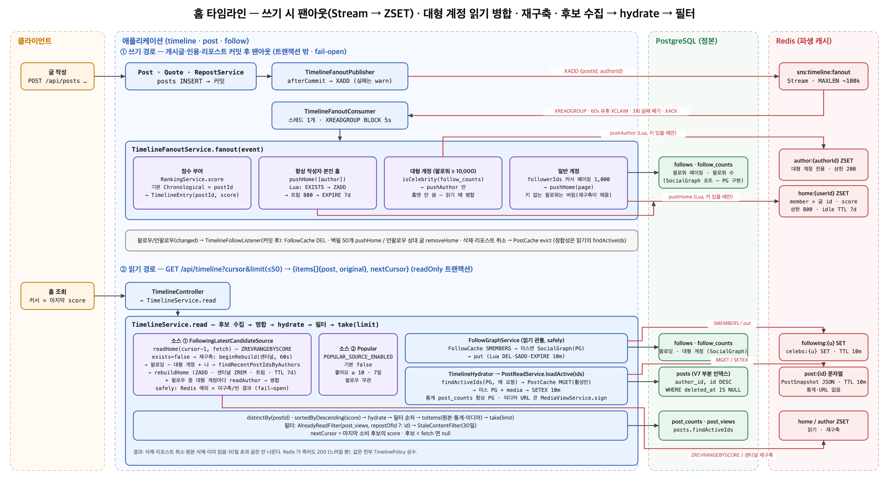

# 타임라인 설계 — Redis 팬아웃

## 문서 목적과 범위

- **홈 타임라인**(사용자가 팔로우하는 사람들과 자신의 게시글 행을 최신순으로 읽는 것)의 아키텍처 결정이다. 2026-09-20 설계 확정 후 **같은 날 구현**(`timeline` 패키지,
  `postgresql/V7`) — 현재 사실은 `.claude/rules/timeline.md`, 계약은 README "타임라인 API", 요약은 `.claude/docs/05-timeline.md`.
- 요구: ① 타임라인 시스템 아키텍처 ② 저장소는 **Redis** ③ **팬아웃** 아키텍처.
- 범위 밖: 랭킹·추천 (시간순만), 검색, 차단·뮤트, 알림, 다른 서비스로의 이벤트 발행 (팬아웃 큐는 우리 Redis 안에서만 돈다), 사용자별 게시글 목록·팔로워 목록 API (별도 결정).
- 전제 (이미 결정된 것): 게시글·답글·인용·리포스트 행이 **`posts` 한 테이블**(통합형 — 타임라인이 한 테이블을 읽으려고 택했다, `게시글 설계.md` "1. 게시글 도메인"), 리포스트는 본문 빈
  행, 리포스트 행에 대한 반응은 원본 귀속, 팔로우는 `follows` 소프트 삭제 + `follow_counts` 통계 행, Redis 는 세션·로그인 잠금에만 쓰고 있음 (`sns:session`
  네임스페이스).
- 용어: **타임라인 항목** = 게시글 행 id 하나. **팬아웃** = 게시글 하나를 팔로워 각자의 타임라인에 복사하는 것. **대형 계정** = 팔로워 수가 임계값 이상이라 팬아웃하지 않는 작성자.
  **재구축** = Redis 에 타임라인이 없을 때 PostgreSQL 에서 다시 만드는 것.

## 아키텍처 흐름

## 1. 팬아웃 방식 — 쓰기 시 팬아웃 + 대형 계정만 읽기 시 병합

### 문제

읽기 시 조립 (pull: 요청마다 `posts JOIN follows … ORDER BY id DESC`)은 팔로잉 수에 비례해 느려지고 타임라인이 가장 많이 읽히는 화면이라 DB 가 읽기 부하를 그대로 받는다.
쓰기 시 팬아웃 (push)은 읽기가 키 하나 조회로 끝나지만 팔로워가 많은 작성자의 글 하나가 팔로워 수만큼의 쓰기가 되어 지연·비용이 폭발한다.

### 근거와 도입 방법

- **기본은 push**: 게시글 행이 커밋되면 작성자의 팔로워 각자 (+ 작성자 자신)의 타임라인 ZSET 에 그 id 를 넣는다 — 단 **키가 있는 (최근 읽은) 사용자에게만**(§8). 읽기는
  `ZREVRANGEBYSCORE` 한 번.
- **대형 계정은 push 하지 않는다 (하이브리드)**: 작성자의 `follow_counts.follower_count` 가 `TimelinePolicy.CELEBRITY_MAX_FOLLOWERS`(10,000)
  이상이면 팔로워 타임라인 대신 **작성자 타임라인** `sns:timeline:author:{authorId}` 에만 넣는다. 읽는 쪽이 자기가 팔로우하는 대형 계정들의 작성자 타임라인을 홈 타임라인과 **점수
  순으로 병합**한다. 임계값 판정은 통계 행 PK 조회 1회 (팔로워 `COUNT` 아님 — `팔로우 시스템 설계.md` "2. — 개정").
- **무엇이 실리나**: 일반 게시글 · 인용 · **리포스트 행**(본문 빈 행 그대로 — 카드는 §4 에서 원본을 함께 싣는다). **답글은 싣지 않는다** — 대화 맥락 없이 답글만 카드가 되면 타임라인이
  대화 조각으로 채워진다. 답글 노출 (예: "팔로우하는 두 사람 사이의 답글")은 후속 결정. 좋아요·조회 기록은 게시글 행이 아니므로 애초에 대상이 아니다.
- **자기 글**은 자기 타임라인에도 들어간다 (작성자를 팔로워 집합에 더한다).
- 기각: **순수 pull** — 팔로잉 500 명 × 최근 글 스캔이 요청마다 반복, 타임라인이 서비스의 주 읽기 경로라 DB 가 첫 병목이 된다. **전원 push** — 팔로워 100만 계정의 글 하나가
  100만 ZADD, 팬아웃 지연이 분 단위로 늘고 큐가 밀린다 (트위터의 유명한 "저스틴 비버 문제"). 하이브리드가 두 극단의 비용을 각각 상한 아래로 묶는다.

### 결과

- 읽기 = ZSET 조회 1회 + (대형 계정 수만큼) 작성자 ZSET 조회 + 게시글 hydrate (PK IN). 쓰기 = 팔로워 수 × ZADD, 단 임계값 이하일 때만.

## 2. Redis 자료구조와 키

### 문제

타임라인을 Redis 어디에 어떤 모양으로 두고, 얼마나 오래·얼마나 크게 유지하는가. Redis 는 지금 세션 정본 (fail-closed)으로 쓰이고 있어, 타임라인이 같은 인스턴스에 얹히면 메모리·장애 반경을
같이 정해야 한다.

### 근거와 도입 방법

| 키                               | 타입   | member / field       | score        | 상한 · TTL                                        |
|----------------------------------|--------|----------------------|--------------|---------------------------------------------------|
| `sns:timeline:home:{userId}`     | ZSET   | 게시글 행 id         | 게시글 행 id | 최근 `HOME_TIMELINE_SIZE`(800) 개 · idle 7일      |
| `sns:timeline:author:{authorId}` | ZSET   | 게시글 행 id         | 게시글 행 id | 최근 `AUTHOR_TIMELINE_SIZE`(200) 개 · idle 7일    |
| `sns:timeline:fanout`            | Stream | `{postId, authorId}` | —            | `MAXLEN ~ 100000` · 소비자 그룹 `timeline-fanout` |

- **score = 게시글 행 id**: `posts.id` 는 IDENTITY 로 단조 증가라 `created_at` 과 같은 순서이고, 커서 (§4)로 그대로 쓸 수 있으며 중복 score 가 없다. 기각:
  `created_at` epoch — 같은 밀리초 충돌, 커서 변환 필요.
- **상한은 `ZREMRANGEBYRANK key 0 -(N+1)`** 을 ZADD 뒤에 붙인다. 800 은 "스크롤로 도달할 만한 깊이" 이며 그 뒤는 끝 (`nextCursor = null`)이다 — 더 오래된
  글은 타임라인이 보여 주지 않는다 (README 와 일치).
- **idle TTL**: 읽기와 (키가 있을 때의) 쓰기 때마다 `EXPIRE 7d`. 7일 안 들어온 사용자의 타임라인은 사라지고 다음 읽기에 재구축된다 — **키가 있는 사용자 = 활성 사용자**라 메모리가
  활성 수에 비례한다.
- **메모리 산정**: ZSET 원소 ≈ 80 B (member 문자열 + skiplist + dict) → 800 × 80 B ≈ 64 KB/사용자. 활성 10만 명 ≈ 6.4 GB, 100만 명 ≈ 64 GB.
  활성 규모에 따라 `HOME_TIMELINE_SIZE` 를 400 으로 줄이면 절반. 세션 (`sns:session`, 수 KB/사용자)과 같은 인스턴스에 두면 타임라인이 메모리를 지배하므로 **운영에선
  타임라인용 Redis 를 분리**(`spring.data.redis` 와 별개 커넥션 팩토리 — 후속)하는 것을 기본으로 한다 — 세션은 fail-closed 정본, 타임라인은 재구축 가능한 캐시라 가용성 요구도
  다르다. 로컬·테스트는 같은 Redis.
- **네임스페이스** `sns:timeline:*` — `sns:session` 옆. 앱 코드가 세션 키를 조합하지 않는 규칙과 같이, 타임라인 키는 `TimelineKeys` 한 곳에서만 만든다.
- 기각: **LIST (LPUSH/LTRIM)** — 삭제·언팔로우 때 특정 항목 제거 (`LREM`)가 O (N) 이고 커서 범위 조회가 없다. **Hash/String 에 JSON 카드 저장** — 게시글
  통계·삭제 여부가 바뀔 때마다 모든 팔로워 사본을 고쳐야 한다 (이중 저장소 — `decisions.md` Redis 카운터 기각과 같은 이유). ZSET 엔 **id 만** 두고 내용은 읽을 때
  PostgreSQL 에서 hydrate 한다.

### 결과

- Redis 에는 **id 의 순서**만 있고 내용·통계·삭제 여부는 PostgreSQL 이 정본이다. Redis 를 통째로 비워도 다음 읽기에 재구축된다.

## 3. 쓰기 경로 — 커밋 후 Stream 에 넣고 소비자가 팬아웃

### 문제

팬아웃을 게시글 작성 트랜잭션 안에서 하면 Redis 장애가 게시글 작성을 막고, 팔로워 수만큼의 ZADD 가 응답 지연이 된다. 트랜잭션 밖에서 하면 "커밋됐는데 팬아웃이 안 됨" 과 "팬아웃됐는데 롤백됨" 을
어떻게 막는가.

### 근거와 도입 방법

- **커밋 후에만**: `PostService.create`·`QuoteService.quote`·`RepostService.repost` 가
  `TransactionSynchronization.afterCommit` 에서 `XADD sns:timeline:fanout {postId, authorId}`
  한 번. 트랜잭션 안의 Redis 호출 금지 규칙 (`rules/stack-kotlin-spring.md`)을 지키고, 롤백된 글은 절대 팬아웃되지 않는다. `XADD` 실패 (Redis 장애)는 **warn
  로그 + 게시글 작성은 성공**
  — 타임라인은 최신성만 잃고 다음 재구축 (§4)에서 복구된다. 세션과 달리 **타임라인은 fail-open** 이다 (§5).
- **소비자**: `@Profile("!test")` 빈 `TimelineFanoutConsumer` 가 스레드 하나로
  `XREADGROUP GROUP timeline-fanout {instanceId} BLOCK 5000 COUNT 32` 루프.
    1. `follow_counts.follower_count(authorId)` ≥ 임계값 → `ZADD sns:timeline:author:{authorId}` + 상한 + TTL 만 하고 끝.
    2. 아니면 팔로워 id 를 PostgreSQL 에서 **커서 페이징**
       (`SELECT follower_id FROM follows WHERE following_id = ? AND deleted_at IS NULL AND follower_id > ? ORDER BY follower_id LIMIT 1000`
       — 기존 `idx_follows_active_following(following_id, follower_id) WHERE deleted_at IS NULL`(V3) 을 탄다) → 작성자 자신을 더해
       **파이프라인**으로 페이지마다
       `ZADD` + `ZREMRANGEBYRANK` + `EXPIRE`.
    3. `XACK`. 처리 중 죽으면 PEL 에 남고, 다른 인스턴스가 `XAUTOCLAIM … MIN-IDLE 60000` 으로 가져간다. **재처리는 멱등** — `ZADD` 는 같은 member 를 다시
       넣어도 상태가 같다.
    4. 같은 메시지가 3번째 실패하면 (`XPENDING` delivery count ≥ `MAX_DELIVERIES` 3) 로그 error + `XACK` 로 버린다 — 그 글은 팔로워 타임라인에 빠질 수
       있고 재구축이 메운다.
- **다중 인스턴스**: 소비자 그룹이 메시지를 인스턴스별로 나눠 준다. 인스턴스 id 는 호스트명+PID.
- **팔로우/언팔로우**(`FollowService`, 커밋 후):
    - 팔로우 → `followingId` 의 최근 글 `BACKFILL_SIZE`(50) 개 id 를 PostgreSQL 에서 읽어 팔로워 홈 타임라인에 `ZADD`(대형 계정이면 생략 — 읽기 병합이 담당).
      동기, 작은 작업.
    - 언팔로우 → `followingId` 의 최근 `HOME_TIMELINE_SIZE` 개 id 를 읽어 `ZREM`. 홈 타임라인 상한이 800 이라 그보다 오래된 항목은 이미 없다. 기각: 읽기 시 팔로잉
      여부 필터 — 요청마다 팔로잉 집합을 확인해야 한다.
- **삭제는 팬아웃하지 않는다**: 게시글 소프트 삭제 (및 리포스트 캐스케이드)는 Redis 를 건드리지 않고 **읽기 시 hydrate 가 `deleted_at IS NULL` 로 거른다**(§4). 항목은
  상한에 밀려 자연 소멸. 기각: 삭제 팬아웃 (팔로워 전원 `ZREM`) — 쓰기 비용은 같고 얻는 것은 ZSET 의 빈자리뿐.

### 결과

- 게시글 작성 응답 시간은 팔로워 수와 무관 (XADD 1회). 팬아웃 지연 목표는 **수 초**(팔로워 1만 명 = 페이지 10개 × 파이프라인).
- 유실 경로는 셋 — `XADD` 실패, 메시지 3회 실패 폐기, 키 없는 사용자에게 온 팬아웃 (§8, 다음 읽기의 재구축이 메움) — 전부 warn/error 로그 + 재구축으로 복구. 잘못 들어가는 경로는
  없다 (커밋 후에만 넣고, 읽기가 삭제·존재를 다시 확인).

## 4. 읽기 경로 — 커서 페이지네이션 + 재구축 + hydrate

### 문제

키가 없을 때 (신규·TTL 만료·Redis 초기화) 무엇을 주는가, 삭제된 글과 대형 계정 글을 어떻게 합치는가, 클라이언트는 어떻게 이어 읽는가.

### 근거와 도입 방법

- `GET /api/timeline?cursor={postId}&limit={1..50}` (인증 필요). 응답 `{items[], nextCursor}`. `cursor` 는 "이 id 보다 작은 것부터" — 첫
  요청은 생략.
- **조회**: `ZREVRANGEBYSCORE sns:timeline:home:{me} ({cursor} -inf LIMIT 0 {limit+여유}` → 삭제로 빠질 것을 감안해 `limit × 1.5` 를
  가져온다.
- **대형 계정 병합**: 내가 팔로우하는 대형 계정 목록 (`follows JOIN follow_counts WHERE follower_id = ? AND follower_count >= 임계값`, 커서마다
  1회 — 결과는 수십 개 이하)의
  `sns:timeline:author:{id}` 를 같은 범위로 읽어 **점수 내림차순 k-way 병합**, 상위 `limit` 개. 작성자 ZSET 이 비어 있으면 (그 계정이 7일 동안 글이 없어 TTL
  만료) 그 계정의 최근 글을 PostgreSQL 에서 `AUTHOR_TIMELINE_SIZE` 개 읽어 다시 채운다.
- **재구축**(홈 키 없음):
  `SELECT id FROM posts WHERE author_id IN (내 팔로잉 ∪ 나) AND parent_post_id IS NULL AND deleted_at IS NULL ORDER BY id DESC LIMIT HOME_TIMELINE_SIZE`
  (대형 계정은 제외 — 읽기 병합 담당) → 전부 `ZADD` + TTL → 이후 정상 경로. 한 요청 안에서 끝나므로 **재구축 중 요청은 느리지만 성공**한다. 팔로잉이 0 이면 자기 글만.
- **hydrate**: 병합된 id 로 `posts WHERE id IN (…) AND deleted_at IS NULL`(삭제·캐스케이드된 리포스트 행은 여기서 빠진다) + `post_counts` PK
  IN + `media` post_id IN → 게시글 응답과 같은 모양. **리포스트 행이면 원본을 함께 싣는다**(`original: {…게시글 응답…}`) — 원본이 삭제됐으면 리포스트 행도 캐스케이드로
  삭제돼 이미 빠져 있다. 리포스트 행의 `counts`
  는 0 이고 클라이언트는 `original.counts` 를 보인다 (귀속 결정).
- `nextCursor` = 마지막 항목의 id. 항목이 `limit` 보다 적어도 `nextCursor` 가 있으면 더 있을 수 있다 (삭제 필터 때문) — 클라이언트는 `nextCursor` 가 `null` 일
  때만 끝으로 본다.
- 기각: **offset 페이지네이션** — 새 글이 앞에 들어오면 중복·건너뜀. **Redis 에 카드 JSON 캐시** — §2 기각과 같음.

### 결과

- 응답 지연 = Redis 왕복 1~2회 + PostgreSQL PK IN 조회 3회 (게시글·통계·미디어). 재구축 요청만 `posts` 인덱스 스캔 1회.

## 4b. 뷰 생성 파이프라인 — 후보 수집 · 필터링 (구현 후 개정)

### 문제

읽기 경로 한 서비스가 "Redis 에서 읽고, 없으면 재구축하고, 대형 계정을 병합하고, PostgreSQL 에서 hydrate 하고, 삭제를 거르고, 커서를 계산" 을 전부 맡으면 후보 출처 (팔로우 기반 최신
글 · 인기 글 · 유사 사용자)나 필터 (이미 읽음 · 차단 · 오래된 글 · 정책 위반)를 하나 더할 때마다 그 서비스가 바뀐다.

### 근거와 도입 방법

- **저차원 문제는 인터페이스로**: `TimelineCandidateSource.collect(userId, beforeId, limit): List<Long>`("후보 id 를 내라") ·
  `TimelineCandidateFilter.filter(userId, posts): List<Post>`
  ("이 후보 중 남길 것") — 둘 다 `fun interface`. `TimelineService.read` 는 **소스 전부 → id 병합 (내림차순) → hydrate (활성만) → 필터 순차 적용 → 카드
  조립 → 커서** 만 안다.
- **고차원 문제는 구현체에 가둔다**: `FollowingLatestCandidateSource`(Redis 홈 ZSET 읽기 · 없으면 재구축 · 대형 계정 작성자 ZSET 병합 — §1~§4 의 팬아웃 규칙
  전부 이 안) ·
  `PopularCandidateSource`(최근 `window` 안 `like_count >= min-likes` 인 일반 글, 기본 **꺼짐** — 켜면 팔로우하지 않은 사람의 글이 섞인다) ·
  `AlreadyReadFilter`(`post_views` 로 조회 기록이 있는 글 제외 — 조회 기록은 원본 id 기준이라 리포스트 행은 `repost_of_id` 로 묻는다, 기본 켜짐) ·
  `StaleContentFilter`(작성 후 `max-age` 30일 초과 제외).
  `TimelineHydrator` 는 활성 확인·원본 동봉·통계·미디어 조립만.
- **아직 구현체가 없는 것**(인터페이스 자리만): 유사 사용자 컨텐츠 소스 (신호 데이터 없음) · 차단 사용자 필터 (차단 기능 없음) · 정책 위반 필터 (판정 데이터 없음). 생기면 구현체 한 개를
  `@Component @Order` 로 붙이는 것으로 끝나고 `TimelineService` 는 안 바뀐다.
- **커서 규칙 (필터가 있으니 중요)**: `nextCursor` 는 마지막 *응답 항목* 이 아니라 마지막 *소비한 후보* 의 id — 페이지를 못 채웠으면 후보 전부를 소비한 것이고, 후보 수가 `fetch`
  (limit×1.5+1) 에 못 미치면 끝 (`null`). 후보가 전부 걸러져 항목이 0 이어도 후보가 `fetch` 를 채웠으면 커서가 나가 클라이언트가 이어 읽는다.
- **랭킹은 넣지 않았다**: 순서는 여전히 id 내림차순. 읽기 시 정렬 단계 (`TimelineRanker`)를 두려면 커서가 "점수+id" 가 되어 계약이 바뀐다 — 후속 결정.
- 기각: **소스별 서비스 메서드 분기** — 소스가 늘수록 `TimelineService` 가 커진다. **필터를 SQL WHERE 에 몰기** — 이미 읽음 (`post_views`)·차단·정책은 각각 다른
  테이블·저장소라 한 쿼리로 못 묶고, Redis 후보에는 SQL 이 없다.

### 결과

- 소스·필터 추가 = 클래스 1개. 값은 `TimelinePolicy` 상수 (`POPULAR_SOURCE_ENABLED`·`POPULAR_MIN_LIKES`·`POPULAR_WINDOW`·
  `ALREADY_READ_FILTER_ENABLED`·`STALE_MAX_AGE`) — 인기 소스는 상수가 참일 때만 `TimelineSourceConfig` 가 빈으로 등록한다 (클래스 안엔 토글 분기가 없어
  단위 테스트 가능).

## 5. 정합성·장애·검증

- **정본은 PostgreSQL, Redis 는 파생 캐시**. `decisions.md` 의 "Redis 카운터·캐시 기각 (이중 저장소)" 은 **정본 값이 두 곳**이 되는 통계에 대한 것이고, 타임라인
  ZSET 은 id 순서만 담아 PostgreSQL 에서 언제든 같은 결과로 재구축되는 뷰라 그 결정과 충돌하지 않는다 — 이 문서로 그 경계를 명시한다.
- **Redis 장애 시**: 세션은 fail-closed (401)지만 타임라인 읽기는 **재구축 쿼리로 직접 서빙**(느리지만 200), 쓰기 팬아웃은 warn 후 누락. 타임라인용 Redis 를 분리하면 세션
  Redis 와 장애 반경이 갈린다.
- **순서**: score = id 라 삽입 순서와 무관하게 항상 id 내림차순. 재처리·재구축·백필이 섞여도 같은 결과.
- **어긋날 수 있는 것**: 팬아웃 유실 (§3) → 재구축까지 그 글이 그 팔로워에게 안 보임. 언팔로우 `ZREM` 실패 → 옛 글이 상한에 밀릴 때까지 남음. 둘 다 "최신성·정확성 저하" 이지 데이터
  손상은 아니며, 운영 복구는 `DEL sns:timeline:home:{userId}` 한 번 (다음 읽기에 재구축).
- **테스트**: 서비스 단위 (병합·커서·재구축 판정 — `TimelineStore` 포트를 mock) · Redis Testcontainers (`redis-integration` 프로파일, 세션 테스트와 같은
  층 — ZADD/상한/TTL/Stream 소비·XAUTOCLAIM 재처리 멱등) · PG API (`GET /api/timeline` 계약, 삭제·리포스트·언팔로우 필터 —
  `TestTimelineConfig` 인메모리 대체 (4종)가 `TestSessionConfig`·`TestMediaStorageConfig` 와 같은 짝). 대형 계정 병합·인기 소스는 단위 테스트 (§7).

## 구현 단위 (제안 순서 — 1~4 전부 구현됨)

1. `posts` 인덱스 V7 (`posts(author_id, id DESC) WHERE deleted_at IS NULL AND parent_post_id IS NULL`; 팔로워 페이징은 기존
   `idx_follows_active_following` 으로 충분) + `TimelineStore` 포트 + Redis 어댑터 (ZSET/Stream) + 인메모리 대체.
2. 팬아웃 발행 (커밋 후 XADD) + 소비자 + 팔로우/언팔로우 백필/제거.
3. `GET /api/timeline` — 조회·재구축·hydrate·커서. 이때 README·`rules/timeline.md`·`05-timeline.md`·GLOSSARY §0 개정.
4. 대형 계정 하이브리드 (임계값·작성자 ZSET·병합) — 1~3 이 먼저 돌아가는 상태에서 붙인다.

## 6. 조회 흐름 개정 — FollowCache · SocialGraph · PostCache · RankingService (구현 후 개정)

### 문제

§4/§4b 의 읽기 경로는 팔로잉 집합·대형 계정 목록을 요청마다 PostgreSQL 에서 읽고, 게시글 내용도 매번 PK IN 으로 읽었다. 요구된 조회 흐름은
`TimelineService → FollowCache → FollowDB`, `→ GraphDB`, `→ TimelineCache → PostCache → PostDB`,
`RankingService → TimelineCache` 다.

### 근거와 도입 방법

| 그림                               | 구현                                                                                                                                                                                        | 비고                                                                                                                                                                                                                                                                                                                                          |
|------------------------------------|---------------------------------------------------------------------------------------------------------------------------------------------------------------------------------------------|-----------------------------------------------------------------------------------------------------------------------------------------------------------------------------------------------------------------------------------------------------------------------------------------------------------------------------------------------|
| **FollowCache → FollowDB**         | `FollowCache` 포트 → `RedisFollowCache`: `sns:timeline:following:{userId}` SET(팔로잉 집합) · `sns:timeline:celebs:{userId}` SET(팔로우 중인 대형 계정) — 둘 다 TTL `FOLLOW_CACHE_TTL` 10분 | `FollowGraphService` 가 읽기 관통. 미스와 **빈 집합을 구분**(빈 집합은 `-` 마커 원소). 팔로우/언팔로우 커밋 후 팔로잉 키·대형 계정 키 **DEL**(§8 — SADD/SREM 은 "SELECT ↔ put" 경합에서 no-op 이 될 수 있어 기각)                                                                                                                             |
| **GraphDB**                        | `SocialGraph` 포트 → `FollowDbSocialGraph`(PG `follows`·`follow_counts` native)                                                                                                             | 스택에 그래프 DB 가 없다. 팔로잉/팔로워/팔로워 수/대형 계정 조회를 포트로 묶어 그래프 DB 가 오면 어댑터만 교체                                                                                                                                                                                                                                |
| **TimelineCache**                  | `TimelineStore`(Redis ZSET) — member = 게시글 행 id, **score = `RankingService.score()`**                                                                                                   | §2 의 "score = id" 를 랭킹 포트가 주는 값으로 일반화. `TimelineEntry(postId, score)` 가 소스·저장소 경계 타입, 커서 = score                                                                                                                                                                                                                   |
| **PostCache → PostDB**             | `PostCache` 포트 → `RedisPostCache`: `sns:timeline:post:{id}` 문자열(JSON `PostSnapshot`, TTL 10분)                                                                                         | `PostReadService` 가 읽기 관통(`MGET` → 미스만 `findActiveByIds` → `SETEX` 파이프라인). **불변 필드만**(본문·작성자·참조·작성 시각·미디어 `storageKey` — URL 은 hydrate 시 서명) 캐시하고 **통계는 항상 PostgreSQL**(`post_counts` PK IN) — 통계 캐시 기각 결정 유지. 삭제는 `PostService.delete` 커밋 후 `evict`(정합성은 `findActiveIds`). 캐시 장애는 warn + DB 진행 |
| **RankingService → TimelineCache** | `RankingService.score(postId, createdAt): Long` 포트 → 기본 `ChronologicalRankingService`(= postId)                                                                                         | 팬아웃·백필·재구축·인기 소스가 ZSET 에 쓸 점수를 여기서 받는다(`TimelineFanoutService.entriesOf`). 랭킹 전략을 바꾸면 **새로 쓰이는 항목부터** 반영되고 기존 ZSET 은 재구축(`DEL`)으로                                                                                                                                                        |

- 재구축 쿼리는 `posts JOIN follows` 한 문장에서 **팔로잉 집합 (FollowCache) → `author_id IN (…)`** 두 단계로 바뀌었다
  (`findRecentPostIdsByAuthors`). 대형 계정은 집합에서 빼고 자기 id 를 더한다.
- 리포스트 원본 동봉·삭제 필터도 `PostReadService.loadActive` 를 지난다 — 매 요청 `findActiveIds` 가 활성 여부를 PG 에 물어 삭제된 원본·캐스케이드된 리포스트 행을 거른다(§8 6차);
  evict 는 스냅샷 잔상 정리용이지 정합성 장치가 아니다.
- 기각: **PostCache 에 통계 포함** — 좋아요마다 무효화, 이중 저장소. **FollowCache 없이 SQL join 유지** — 팔로잉 500 명 사용자의 재구축·대형 계정 판정이 요청마다
  join. **RankingService 를 읽기 시 정렬로** — 그림은 캐시를 채우는 쪽이고, 읽기 정렬은 커서 계약을 깬다 (§4b).

### 결과

- 정상 읽기 = Redis 4~5회 (홈 ZSET · celebs SET · 게시글 MGET · 대형 계정 ZSET) + PostgreSQL 1회 (통계) [+ 미스분]. 재구축 시 FollowCache 미스
  1회 + posts 인덱스 스캔 1회.
- 커서는 score 이며 기본 랭킹에선 여전히 게시글 id — README 계약 불변. 점수가 같은 항목이 생기는 랭킹을 쓰면 커서 경계에서 중복·누락이 가능 (후속: score+id 복합 커서).

## 7. 값의 위치 — 전부 코드 상수 (구현 후 개정)

### 문제

초기 구현은 16개 값을 `TimelineProperties`(`sns.timeline.*`)로 외부화했다. 그중 환경마다 달라야 하는 값은 없었고, 계약 (README "최근 50개"·"최대
50"·"30일"·"7일")에 박힌 값을 설정으로 흔들면 문서가 거짓이 되며, 튜닝 상수 (페이지 크기·폴링·재전달 횟수)는 코드 리뷰를 거쳐 바뀌는 것이 맞다.

### 근거와 도입 방법

- **`timeline.domain.TimelinePolicy` 한 곳**: `HOME_TIMELINE_SIZE` 800 · `AUTHOR_TIMELINE_SIZE` 200 · `IDLE_TTL` 7d ·
  `BACKFILL_SIZE` 50 · `PAGE_MAX_LIMIT` 50 ·
  `CELEBRITY_MAX_FOLLOWERS` 10,000 · `FOLLOW_CACHE_TTL` 10m · `POST_CACHE_TTL` 10m · `REBUILD_SENTINEL_TTL` 60s ·
  `STALE_MAX_AGE` 30d · `ALREADY_READ_FILTER_ENABLED` · `POPULAR_SOURCE_ENABLED`(false) ·
  `POPULAR_MIN_LIKES` 10 · `POPULAR_WINDOW` 7d ·
  `Fanout.{FOLLOWER_PAGE_SIZE 1,000, STREAM_MAX_LENGTH 100k, POLL_COUNT 32, POLL_BLOCK 5s, CLAIM_MIN_IDLE 60s, MAX_DELIVERIES 3}`.
  `MediaPolicy` 와 같은 꼴. `TimelineProperties`·yaml `sns.timeline` 블록은 없다.
- **토글은 빈 등록으로**: `POPULAR_SOURCE_ENABLED` 가 참일 때만 `TimelineSourceConfig` 가 `PopularCandidateSource` 를 등록한다.
- **대가**: 테스트가 임계값을 낮춰 API 층에서 대형 계정 병합·인기 소스를 돌려 보던 것을 못 한다 → 그 두 경로는 단위 테스트 (`FollowingLatestCandidateSourceTests`·
  `TimelineFanoutServiceTests`·`PopularCandidateSourceTests`)가 맡고, API 테스트는 해당 native 쿼리 두 개를 실 PostgreSQL 에서 직접 호출해 SQL
  만 검증한다.
- 기각: **운영 손잡이 두 개 (`CELEBRITY_MAX_FOLLOWERS`·`HOME_TIMELINE_SIZE`)만 env 로** — 값 하나 바꾸는 데 재배포가 드는 비용보다, "어느 값이 계약이고 어느
  값이 손잡이인지"
  를 한 파일에서 읽는 이득이 지금 규모에선 크다. 운영에서 실제로 흔들 필요가 생기면 그 두 개만 다시 꺼낸다.

### 결과

- 타임라인 관련 값을 바꾸는 변경은 항상 `TimelinePolicy` 한 파일 + 문서 짝 (README 문단·`rules/timeline.md`)이다.

## 8. 리뷰 반영 — 캐시 전제가 깨지던 지점 (구현 후 개정)

### 문제

"Redis 는 파생 캐시, PostgreSQL 이 정본, 키가 없으면 재구축" 이 코드에서 세 군데 깨져 있었다. ① 팬아웃·백필·자기 글 push 가 **없는 홈 키를 만들어**, 만료·초기화·운영 `DEL` 뒤
첫 팬아웃이 항목 1개짜리 키를 만들면 그 뒤 읽기는 `exists=true` 라 재구축을 영영 안 했고, 매 push 가 `EXPIRE` 를 갱신해 "7일 미접속 키 소멸" 도 성립하지 않았다. ②
`TimelineStore`·`FollowCache` 호출에 예외 가드가 없어 Redis 장애 시 `GET /api/timeline` 이 500 — fail-open 약속 위반. ③ `undoRepost` 가 게시글
캐시를 비우지 않아 취소한 리포스트 행이 최대 10분 노출됐다. 그 밖에 대형 계정 본인 글이 자기 홈에 안 들어갔고, 팔로우 캐시의 SADD/SREM 이 "SELECT ↔ put" 경합에서 no-op 이 될 수
있었으며, 스냅샷에 담긴 presigned URL 이 캐시 TTL 과 별개로 만료될 수 있었다.

### 근거와 도입 방법

- **push 는 키가 있을 때만**: `pushHome`/`pushAuthor` 가 Lua (`EXISTS` → `ZADD`·`ZREMRANGEBYRANK`·`EXPIRE`) 로 원자 실행. **홈/작성자 키를
  만드는 경로는 재구축뿐**이다. 재구축은 **센티널을 먼저 놓는다** — `beginRebuild`(`ZADD NX key -1 "-"` + TTL 60초) → PostgreSQL 조회 → `ZADD` 결과 →
  센티널 `ZREM` → 트림·TTL 7일. PG 조회와 `ZADD` 사이에 도착한 팬아웃은 키가 이미 있어 붙는다 (2차 리뷰 지적: 이 창의 push 가 최대 7일 유실되던 경로). **센티널이 남아 있는 키는
  `read` 가 `ZSCORE` 로 알아채 미구축 (`exists=false`)으로 본다** — 그 상태의 읽기는 TTL 을 늘리지 않고 재구축을 다시 시작한다 (3차 리뷰: 센티널만 있는 키를 "구축됨" 으로
  보고 TTL 을 7일로 늘려 영구히 빈 타임라인이 되던 결함). 재구축이 중간에 죽으면 센티널 TTL 60초 뒤 만료되거나 그 전이라도 다음 읽기가 재시작한다. 동시 읽기는 중복 재구축을 하지만 `ZADD`
  병합이라 멱등. 재구축은 더 이상 `DEL` 하지 않는다 (키가 없을 때만 호출되므로 지울 것이 없고, 창 안의 push 를 지우면 안 된다).
- **fail-open 을 실제로**: `FollowingLatestCandidateSource` 가 `readHome/readAuthor/rebuild*` 를, `FollowGraphService` 가
  `FollowCache` 호출을 각각 `safely` 로 감싼다 (warn 후 PostgreSQL 경로). `PostReadService` 와 같은 꼴. Redis 가 죽어도 응답은 200.
- **리포스트 취소도 evict**: `RepostService.undoRepost` 가 `softDeleteRepost` 전에 `findActiveRepostId` 로 행 id 를 얻어 `changed` 면
  `PostReadService.evictAfterCommit`. 이제 게시글 행이 소프트 삭제되는 경로 둘 (`PostService.delete`·`undoRepost`) 모두 evict 한다.
- **대형 계정 본인 홈**: `fanout` 이 대형 계정 여부와 무관하게 먼저 `pushHome([작성자])`, 그 다음 분기. 팬아웃 경로와 재구축 경로 (`authors + userId`)의 결과가
  같아졌다.
- **팔로우 캐시는 evict 로**: 팔로우/언팔로우 커밋 후 `SADD/SREM` 대신 팔로잉 키·대형 계정 키를 **DEL**. 경합 창이 "SELECT ↔ put" 으로 줄고, TTL 을
  `FOLLOW_CACHE_TTL` 10분으로 낮춰 (팔로잉·대형 계정 공통) 잔여 stale 을 묶는다.
- **미디어 URL 은 읽을 때 서명**: `PostSnapshot.media` 엔 `storageKey` 만 (`MediaSnapshot`), hydrate 가 `MediaViewService.sign` 으로
  presigned GET 을 만든다 — 캐시 TTL 과
  `download-url-ttl` 의 결합이 사라졌다.

### 리뷰 반영 — 4차

- **팔로우 캐시 읽기는 `SMEMBERS` 한 번**: `EXISTS` + `SMEMBERS` 두 왕복은 TTL 만료가 사이에 걸리면 "팔로잉 0명" 으로 오판해 홈이 자기 글만으로 재구축·고정되던 경합. 빈
  결과 = 미스 (빈 집합은 `-` 마커로 구분).
- **타임라인 `read` 도 `EXISTS` 를 쓰지 않는다**: `ZSCORE`(센티널) → 범위 → 비면 `ZCARD` 로 키 부재를 판정한다. 만료가 두 명령 사이에 걸려도 "빈 구축됨" 으로 고정되지
  않는다.

### 리뷰 반영 — 5차

- **범위 결과에 센티널이 섞여도 미구축**: `ZSCORE` 와 범위 조회 사이에 다른 요청의 `beginRebuild` 가 끼면 결과에 `-` 가 들어와 `toLong` 으로 죽고, 그 예외가 `safely`
  에 삼켜져 홈이 매번 재구축되던 경로. `read` 가 `-` 를 보면 `exists=false`.
- **인메모리 대체도 같은 판정**: `InMemoryTimelineStore.read` 가 `rebuilding` 집합을 먼저 본다 (4차에 "반영" 으로 적혔으나 코드에 없던 것).
- **이미 읽음 필터는 원본 id 로**: `ViewService` 가 원본 id 로 조회를 기록하므로 `AlreadyReadFilter` 는 `repostOfId ?: id` 로 `post_views` 를
  묻는다 — 읽은 원본의 리포스트 행도 빠진다. (기각: 리포스트 행 id 로도 기록 — "조회수 = 원본 기준" 게시글 계약과 충돌.)

### 리뷰 반영 — 6차

- **삭제 여부는 캐시 히트에도 PostgreSQL 이 답한다**: 캐시 미스 → `findActiveByIds` → `putAll` 사이에 삭제 커밋 + evict 가 끼면 읽기 쪽 `SETEX` 가 evict 뒤에 들어가 삭제된 일반·인용 글의
  스냅샷이 최대 `POST_CACHE_TTL` 10분 남고, 이후 히트는 PG 를 다시 묻지 않아 전 팔로워에게 삭제 글이 보이던 경로. `PostReadService.loadActive` 가 **매 요청 `PostRepository.findActiveIds(ids)`**
  (`SELECT id … WHERE id IN … AND deleted_at IS NULL`, 이미 매 요청 하는 `post_counts` PK IN 옆에 하나 더) 로 활성 id 를 먼저 구하고 그 집합만 캐시에 묻는다 — 스냅샷 본문은 그대로 캐시,
  삭제 여부는 PG. "삭제 여부는 PostgreSQL" 계약(§6)이 evict 성공에 기대지 않고 성립한다. (기각: 문서로 "TTL 안 잔상 감수" — CLAUDE.md·rules 가 이미 PG 를 정본으로 적고 있어 계약 완화보다 조회 하나가 싸다.)

### 리뷰 반영 — 7차

- **팔로우 캐시 `put` 은 Lua 한 번**(`DEL` → `SADD` → `EXPIRE`): 세 왕복이던 때는 `SADD` 뒤 `EXPIRE` 전에 연결이 끊기면 키가 TTL 없이 남고, 예외는 `safely` 가 삼켜 눈치챌 수 없었다.
  팔로잉 키는 그 사용자의 팔로우 변경이 DEL 하지만 대형 계정 키는 팔로우 변경 전까지 영구 고정 — 팔로우 중인 계정이 뒤에 대형 계정이 되면 그 글이 그 사용자에게 안 보이던 경로. `RedisCachesTests` 가 put 뒤 TTL 을 단언한다.
- §6 의 삭제 서술을 6차 메커니즘(`findActiveIds`)으로 맞췄다.

### 리뷰 반영 — 8차

- **팔로우 캐시 Lua 의 `SADD` 는 1,000 개씩**: Redis Lua 5.1 의 `unpack` 은 약 8,000 개(`LUAI_MAXCSTACK`)를 넘으면 "too many results to unpack" 으로 죽는다 — 7차의 `unpack(ARGV, 2)` 한 번 꼴이 들여온 제약.
  팔로잉 8,000 명 넘는 사용자의 put 이 매번 실패해(`safely` 가 삼킴) 캐시가 영구히 안 채워지던 경로. 루프로 조각내되 EVAL 한 번이라 원자성은 같다. `RedisCachesTests` 가 10,000 건을 단언한다.

### 결과

- `TimelineApiTests` 가 "키 없는 사용자에게 팬아웃이 먼저 와도 다음 읽기는 재구축이라 이전 글까지 보인다"·"리포스트를 취소하면 타임라인에서 바로 빠진다" 를,
  `RedisTimelineStoreTests` 가
  "키가 없는 타임라인엔 push 가 들어가지 않는다" 를, `FollowGraphServiceTests`·`FollowingLatestCandidateSourceTests` 가 캐시 예외 시 PostgreSQL
  진행을 고정한다.

## 현재 제약과 후속 판단

- **대형 계정 경계의 하향 전환** — 팔로워 수가 10,000 을 넘었다가 내려온 계정 C 의 "대형 계정 시절" 글은 `author:C` 에만 있고 팔로워 홈엔 없는데, 읽기는 C 를 더 이상 병합하지
  않는다 → C 팔로워의 홈에서 그 글들이 홈 재구축 (7일 미접속 뒤)까지 안 보인다. 자연 변동이 잦은 경계 계정이 생기면 읽기 임계값에 히스테리시스 (예: 병합은 9,000 부터)를 두는 것이 후속 선택지.
  운영 복구는 팔로워 홈 `DEL`.
- **재구축 센티널 창** — 재구축이 센티널을 놓은 뒤 죽으면 다음 읽기가 다시 재구축한다 (센티널 = 미구축). 실패가 계속되면 매 읽기가 PG 인덱스 스캔 1회를 반복 — 그 자체가 신호 (warn 로그).
- **PostCache 에 남는 삭제 글 스냅샷** — evict 실패나 "읽기 SELECT ↔ SETEX" 경합으로 삭제된 글 스냅샷이 최대 10분 남을 수 있지만, `loadActive` 가 매 요청 `findActiveIds` 로 활성 여부를 PG 에 물어 거르므로 응답엔 안 나온다(§8 6차). 잔상은 메모리만 차지한다. **랭킹 점수
  동률 커서**(§6). **GraphDB 없음** — `SocialGraph` 포트만.
- **팔로우 백필은 요청 스레드 동기** — `TimelineFollowListener.afterFollow` 가 `afterCommit` 에서 PG 조회 + `pushHome` 최대 50회(항목마다 파이프라인 1건)를 돌아 팔로우 API 지연이 그만큼 는다.
  정확성 문제는 아니라 그대로 두었고, 지연이 문제 되면 `entries` 를 파이프라인 한 번에 넣는 `pushHomeAll` 꼴이 후속 선택지.
- **유사 사용자 소스 · 차단 필터 · 정책 위반 필터 없음** — 인터페이스 (`TimelineCandidateSource`/`TimelineCandidateFilter`)만 있고 구현체가 없다 (§4b).
  데이터가 생기면 구현체 하나로.
- **답글 미포함** — "팔로우하는 사람들끼리의 답글" 노출 여부는 후속 결정. 넣으려면 팬아웃 대상 조건과 재구축 쿼리의 `parent_post_id IS NULL` 을 같이 바꾼다.
- **시간순만** — 랭킹·추천 없음. 넣더라도 ZSET score 를 바꾸는 게 아니라 파이프라인 필터 뒤 정렬 단계 (`TimelineRanker`)로 — 커서 계약 개정 필요 (§4b).
- **대형 계정 임계값 고정** — `follower_count` 가 임계값을 넘는 순간 그 이전 글은 이미 팔로워 타임라인에 팬아웃돼 있고 이후 글은 작성자 ZSET 으로 간다 — 전환 시점 전후가 섞여도 병합
  결과는 같다 (둘 다 id 순). 임계값을 **내리면** 그 사이 팬아웃됐어야 할 글이 없으므로 팔로워 재구축 필요 (`DEL` 일괄).
- **타임라인 Redis 분리는 운영 결정** — 지금은 세션과 같은 `StringRedisTemplate`. 분리하려면 커넥션 팩토리 하나를 더 두는 후속 작업 (§2).
- **재구축 폭주** — Redis 를 통째로 잃으면 다음 요청들이 동시에 재구축 쿼리를 돌린다. 사용자별 재구축은 1회이고 쿼리가 인덱스 스캔이라 감당 가능하다고 보지만, 필요하면 재구축을
  `SET NX` 로 사용자당 1회로 묶는다 (로그인 잠금과 같은 형).
- **사용자 삭제·차단 없음** — 생기면 팬아웃 대상·읽기 필터를 함께 개정.
- **소비자 스레드 1개/인스턴스** — 팬아웃 처리량이 부족하면 인스턴스 수 또는 스레드 수로 늘린다 (소비자 그룹이 나눠 준다).
